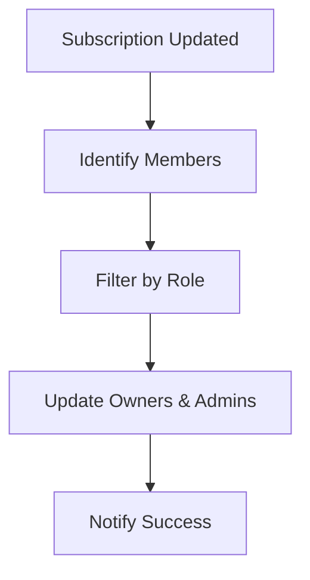

# How Price Push Works

## Architecture Overview

Price Push is built on a sophisticated but user-friendly architecture. Here's how everything works together:

## The Flow

### 1. User Initiates Price Change

When you update a price in the Walkway system:

```
User Interface → Backend API → Validation Layer
```

**What Happens:**
- User changes a price in the frontend
- System validates user permissions
- Backend receives the update request

### 2. Permission Check

Before any price is pushed, the system checks:

- ✅ Is the user authenticated?
- ✅ Does the user have Owner or Admin role?
- ✅ Is Price Push enabled for this subscription?
- ✅ Is the Ventrata API key configured?

!!! warning "Security First"
    If any check fails, the price push is rejected immediately. This prevents unauthorized price changes.

### 3. Data Propagation

Once validated, the system propagates changes:

#### Subscription Level
When you enable/disable Price Push for a subscription:



**What Gets Updated:**
- All **Owners** get Price Push access ✅
- All **Admins** get Price Push access ✅
- **Members** and **Viewers** do NOT get access ❌

#### User Level
Individual user settings inherit from subscription:

```
Subscription.pricePush = true
    ↓
Owner/Admin Users → pricePush = true
    ↓
Member/Viewer Users → pricePush = false
```

### 4. Ventrata Integration

When pushing to Ventrata:

```
1. Prepare Data
   ↓
2. Format for Ventrata API
   ↓
3. Send Request
   ↓
4. Receive Confirmation
   ↓
5. Update Internal Status
   ↓
6. Notify User
```

**Data Included:**
- Product ID
- Option ID
- Availability ID
- Unit pricing (Adult, Child, Senior, etc.)
- Currency
- Effective date

## Automatic Propagation

### New Member Added

When adding a new team member:

```python
if member.role == "OWNER" or member.role == "ADMIN":
    member.pricePush = subscription.pricePush
    member.ventrataApiKey = subscription.ventrataApiKey
else:
    member.pricePush = false
```

**Result:**
- Owners and Admins automatically get Price Push
- Members and Viewers do not

### Role Change

When promoting or demoting a member:

#### Promotion (Member → Admin)
```
Before: user.pricePush = false
Change: user.role = "ADMIN"
After: user.pricePush = subscription.pricePush (true)
```

#### Demotion (Admin → Member)
```
Before: user.pricePush = true
Change: user.role = "MEMBER"
After: user.pricePush = false
```

!!! info "Automatic & Safe"
    All role changes automatically adjust Price Push access. No manual intervention needed.

### Subscription Edit

When editing a subscription:

```typescript
// Before
subscription.pricePush = false

// Admin enables Price Push
subscription.pricePush = true

// Automatic propagation
for (member in subscription.members) {
    if (member.role === "OWNER" || member.role === "ADMIN") {
        member.pricePush = true  // ✅ Updated automatically
    }
}
```

**Propagation Stats:**
```json
{
  "pricePushUpdated": 3,
  "ventrataApiKeyUpdated": 5
}
```

## Data Synchronization

### What Gets Synced?

| Field | Synced to | Frequency |
|-------|-----------|-----------|
| `pricePush` | Owner/Admin only | On change |
| `ventrataApiKey` | All members | On change |
| `ventrataConfiguredAt` | All members | On change |

### When Sync Happens

1. **Subscription Creation**: Owner inherits all settings
2. **Subscription Edit**: All eligible members updated
3. **Member Addition**: New member inherits settings
4. **Role Change**: Access adjusted automatically
5. **API Key Update**: All members receive new key

## Audit Trail

Every price change is tracked:

```json
{
  "id": "change-123",
  "subscriptionId": "sub-456",
  "userId": "user-789",
  "productId": "prod-abc",
  "optionId": "opt-def",
  "oldPrice": 50.00,
  "newPrice": 55.00,
  "status": "APPLIED",
  "appliedAt": "2025-11-01T10:30:00Z",
  "units": [
    {
      "unitType": "ADULT",
      "oldRetail": 5000,
      "newRetail": 5500,
      "currency": "EUR"
    }
  ]
}
```

**Tracked Information:**
- Who made the change
- When it was made
- What was changed (before/after)
- Was it successful?
- Was it reverted?

## Error Handling

### Validation Errors

```
❌ User not authorized
❌ Price Push not enabled
❌ Ventrata API key missing
❌ Invalid price format
❌ Product not found
```

**Result:** Request rejected immediately, no changes made.

### API Errors

```
⚠️ Ventrata API timeout
⚠️ Network connection issue
⚠️ Invalid API response
```

**Result:** Retry logic activated, user notified.

### Recovery

If a price push fails:

1. **Status Updated**: Change marked as "FAILED"
2. **Error Logged**: Detailed error message saved
3. **User Notified**: Clear error message shown
4. **Retry Available**: User can try again
5. **Support Alerted**: Critical failures escalated

## Performance

### Speed
- Permission check: < 50ms
- Database update: < 100ms
- Ventrata API call: 500ms - 2s
- **Total time**: Usually < 3 seconds

### Scalability
- Handles 100+ members per subscription
- Processes 1000+ price changes per day
- Batch operations for efficiency

## Security Measures

### 1. Authentication
- JWT tokens required
- Token expiration enforced
- Refresh tokens for sessions

### 2. Authorization
- Role-based access control
- Subscription-level isolation
- Fine-grained permissions

### 3. Data Protection
- API keys encrypted
- Sensitive data masked in logs
- HTTPS required for all communications

### 4. Audit
- Complete change history
- User action tracking
- Compliance-ready logs

## Technical Stack

**Backend:**
- NestJS (Node.js framework)
- Prisma (Database ORM)
- PostgreSQL (Database)

**Integrations:**
- Ventrata API
- Google Cloud Platform

**Security:**
- JWT Authentication
- Role-Based Access Control
- Encrypted API keys

---

**Next:** [Configuration Guide →](configuration.md)

