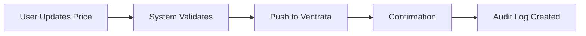

# Price Push Overview

## What is Price Push?

**Price Push** is a powerful feature that allows you to automatically synchronize your pricing data with external booking systems like Ventrata. Think of it as a "one-click" solution to update prices across multiple platforms without manual data entry.

## Why Price Push Matters

### The Problem
Traditionally, updating prices across multiple booking platforms requires:

- ❌ Manual entry on each platform
- ❌ Risk of human error
- ❌ Time-consuming process
- ❌ Inconsistent pricing across platforms
- ❌ Delayed price updates

### The Solution
With Price Push:

- ✅ **One-Click Updates**: Push prices to all platforms instantly
- ✅ **Automatic Synchronization**: Changes propagate automatically
- ✅ **Multiple Unit Types**: Manage ADULT, CHILD, SENIOR, YOUTH, INFANT pricing
- ✅ **Audit Trail**: Complete history of all price changes
- ✅ **Undo Feature**: Quickly revert pricing mistakes
- ✅ **Real-Time Availability**: Get and update availability data

## Key Benefits

### 1. Time Savings
What used to take hours now takes seconds. Update prices once, and they sync everywhere.

### 2. Consistency
Ensure all your booking platforms show the same prices at the same time.

### 3. Flexibility
Support for multiple unit types (ADULT, CHILD, etc.) with customizable pricing rules.

### 4. Safety
Undo feature lets you quickly revert mistakes, plus complete audit trail of all changes.

## How It Works (Simplified)

1. **User Action**: An authorized user updates a price in the system
2. **Validation**: The system checks if the user has permission
3. **Push**: Price is sent to Ventrata (or other platforms)
4. **Confirmation**: System confirms successful update
5. **Audit**: Change is logged for future reference

## What Can You Do with Price Push?

### 💰 Manage Price Units
Set different prices for different customer types:
- **ADULT**: Standard pricing
- **CHILD**: Discounted rates for children
- **SENIOR**: Senior citizen pricing
- **YOUTH**: Teen/young adult rates
- **INFANT**: Free or minimal charge

[Learn about Price Units →](price-units.md)

### 📅 Control Availability
- Get real-time availability data
- Set date-specific pricing
- Implement dynamic pricing based on demand
- Manage time slots and capacities

[Explore Availability →](availability.md)

### 📊 Track Everything
- Complete audit trail of all changes
- See who changed what and when
- Export data for compliance
- Analyze pricing trends

[View History Features →](history.md)

### ⏮️ Undo Mistakes
- One-click undo for recent changes
- Preview impact before reverting
- Maintain complete audit trail
- Bulk undo operations

[Learn about Undo →](undo.md)

## Getting Started

Ready to use Price Push? Follow these steps:

1. **Configure Ventrata**: Set up your Ventrata API key
2. **Enable Price Push**: Activate the feature for your subscription
3. **Set Up Price Units**: Configure unit types and pricing rules
4. **Start Pushing**: Update prices with confidence

[Follow the Configuration Guide →](configuration.md)

## Real-World Example

### Scenario
You're a tour operator offering city tours. You need to:
- Update prices for high season
- Apply the same prices across 3 booking platforms
- Ensure all platforms update simultaneously

### Without Price Push
1. Log into Platform A → Update 50 tour variants → 30 minutes
2. Log into Platform B → Update 50 tour variants → 30 minutes
3. Log into Platform C → Update 50 tour variants → 30 minutes
4. **Total Time**: 90 minutes + risk of errors

### With Price Push
1. Update prices in Walkway system → 5 minutes
2. Click "Push Prices" → 1 minute
3. All platforms updated automatically
4. **Total Time**: 6 minutes, no errors

!!! success "Result"
    **Time saved**: 84 minutes  
    **Error rate**: Near zero  
    **Consistency**: 100%

## Next Steps

- [How Price Push Works](how-it-works.md) - Technical architecture
- [Configuration Guide](configuration.md) - Set up Price Push
- [Price Unit Management](price-units.md) - Manage unit types
- [Availability Management](availability.md) - Get availability data
- [Price Change History](history.md) - Track and analyze changes
- [Undo & Revert](undo.md) - Error recovery
- [Use Cases](use-cases.md) - Real-world scenarios
- [API Endpoints](api-endpoints.md) - Developer reference
- [Troubleshooting](troubleshooting.md) - Common issues

---

**Need help?** Check our [Troubleshooting Guide](troubleshooting.md) or contact support.

