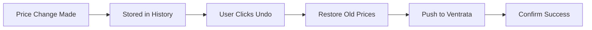

# Undo & Revert Changes

## Overview

Made a mistake with pricing? No problem. The Undo feature allows you to quickly revert price changes back to their previous values, both in Walkway and on Ventrata.

## How Undo Works

### The Undo Process



**What Happens:**
1. Original price change is located in history
2. Old prices are retrieved
3. New "undo" price change is created (reverting to old values)
4. Prices are pushed to Ventrata
5. New history entry is created documenting the undo

!!! success "Safe & Auditable"
    Undoing doesn't delete history. It creates a new entry showing the revert, maintaining a complete audit trail.

## Undoing a Change

### Via API

**Endpoint:** `POST /api/ventrata/price-changes/{id}/undo`

**Request:**
```bash
curl -X POST https://api.walkway.com/api/ventrata/price-changes/change-123/undo \
  -H "Authorization: Bearer TOKEN" \
  -H "Content-Type: application/json" \
  -d '{
    "reason": "Incorrect pricing applied by mistake"
  }'
```

**Response:**
```json
{
  "success": true,
  "originalChangeId": "change-123",
  "undoChangeId": "change-456",
  "message": "Price change successfully reverted",
  "restoredPrices": [
    {
      "unitType": "ADULT",
      "currentPrice": 5500,
      "restoredPrice": 5000,
      "currency": "EUR"
    },
    {
      "unitType": "CHILD",
      "currentPrice": 2750,
      "restoredPrice": 2500,
      "currency": "EUR"
    }
  ],
  "pushedToVentrata": true,
  "pushedAt": "2025-11-01T11:15:00Z"
}
```

### Via Dashboard

1. Navigate to **Price Change History**
2. Find the change you want to undo
3. Click **"Undo"** button
4. Confirm the action
5. (Optional) Add a reason
6. Click **"Confirm Undo"**

**Result:**
- ✅ Prices immediately revert to previous values
- ✅ Change pushed to Ventrata automatically
- ✅ New history entry created

## What Can Be Undone?

### ✅ Can Be Undone

- Individual price changes (single availability)
- Bulk price changes (multiple availabilities)
- Unit-specific changes (e.g., only ADULT pricing)
- Changes from any time period (within retention)
- Both successful and partially successful changes

### ❌ Cannot Be Undone

- Changes older than retention period
- Changes where product/option no longer exists
- Changes already undone (prevents double-undo)
- Changes where Ventrata API is unavailable

## Bulk Undo

### Undo Multiple Changes

Revert several related changes at once:

**Endpoint:** `POST /api/ventrata/price-changes/bulk-undo`

**Request:**
```json
{
  "changeIds": [
    "change-123",
    "change-124",
    "change-125"
  ],
  "reason": "Reverting seasonal pricing test"
}
```

**Response:**
```json
{
  "success": true,
  "totalRequested": 3,
  "successful": 3,
  "failed": 0,
  "results": [
    {
      "originalChangeId": "change-123",
      "undoChangeId": "change-456",
      "status": "success"
    },
    {
      "originalChangeId": "change-124",
      "undoChangeId": "change-457",
      "status": "success"
    },
    {
      "originalChangeId": "change-125",
      "undoChangeId": "change-458",
      "status": "success"
    }
  ]
}
```

### Undo by Filter

Undo all changes matching criteria:

```json
{
  "filter": {
    "productId": "city-tour",
    "startDate": "2025-11-01",
    "endDate": "2025-11-07",
    "userId": "user-123"
  },
  "reason": "Reverting John's changes from last week"
}
```

!!! warning "Use with Caution"
    Bulk undo operations affect multiple prices. Always preview before confirming.

## Undo Limitations

### Time-Based Restrictions

| Plan | Undo Window |
|------|-------------|
| Starter | 7 days |
| Professional | 30 days |
| Enterprise | 90 days |

After the undo window expires, changes can still be manually reverted but not with one-click undo.

### Booking Considerations

⚠️ **Important:** If bookings have been made at the new price, undoing will:

1. Restore old prices for **future bookings**
2. **NOT affect existing bookings** - they keep the price they were booked at
3. Create potential pricing confusion

**Best Practice:**
- Check if bookings exist before undoing
- Consider creating new pricing instead of undoing
- Communicate price changes to customers if needed

**Check for Bookings:**
```bash
GET /api/ventrata/bookings?availabilityId={id}&afterDate={changeDate}
```

If bookings exist:
```json
{
  "hasBookings": true,
  "bookingCount": 3,
  "totalRevenue": 16500,
  "warning": "3 bookings exist at current price. Undoing will affect future bookings only."
}
```

## Partial Undo

### Undo Specific Units Only

Revert only certain unit types:

**Request:**
```json
{
  "changeId": "change-123",
  "unitsToUndo": ["ADULT", "SENIOR"],
  "reason": "Only reverting adult/senior pricing, keeping child discount"
}
```

**Response:**
```json
{
  "success": true,
  "undoChangeId": "change-456",
  "undonUnits": ["ADULT", "SENIOR"],
  "unchangedUnits": ["CHILD", "INFANT"],
  "restoredPrices": [
    {
      "unitType": "ADULT",
      "restoredPrice": 5000
    },
    {
      "unitType": "SENIOR",
      "restoredPrice": 4000
    }
  ]
}
```

## Undo History

### View Undo Operations

See all undo operations performed:

```bash
GET /api/ventrata/price-changes?isUndo=true
```

**Response:**
```json
{
  "data": [
    {
      "id": "change-456",
      "isUndo": true,
      "originalChangeId": "change-123",
      "userEmail": "john@company.com",
      "reason": "Incorrect pricing applied by mistake",
      "createdAt": "2025-11-01T11:15:00Z"
    }
  ]
}
```

### Undo Chain

Track changes and their undos:

```bash
GET /api/ventrata/price-changes/change-123/chain
```

**Response:**
```json
{
  "originalChange": {
    "id": "change-123",
    "createdAt": "2025-11-01T10:00:00Z",
    "userEmail": "john@company.com",
    "newRetail": 5500
  },
  "undo": {
    "id": "change-456",
    "createdAt": "2025-11-01T11:00:00Z",
    "userEmail": "jane@company.com",
    "restoredRetail": 5000
  },
  "subsequentChanges": [
    {
      "id": "change-789",
      "createdAt": "2025-11-01T14:00:00Z",
      "userEmail": "john@company.com",
      "newRetail": 5200
    }
  ]
}
```

## Alternative: Manual Revert

### When to Use Manual Revert

Use manual revert instead of undo when:
- Change is outside undo window
- You want different prices (not exact old values)
- Original change data is incomplete
- You need to make additional adjustments

### Manual Revert Process

1. Look up old prices from history
2. Create new price change with old values
3. Push to Ventrata

**Example:**
```javascript
// Get old prices
const originalChange = await fetch(
  `/api/ventrata/price-changes/change-123`
);

// Create new change with old values
const revert = await fetch('/api/ventrata/price-changes', {
  method: 'POST',
  body: JSON.stringify({
    productId: originalChange.productId,
    optionId: originalChange.optionId,
    availabilityId: originalChange.availabilityId,
    units: originalChange.units.map(unit => ({
      unitType: unit.unitType,
      oldRetail: unit.newRetail, // Current price
      newRetail: unit.oldRetail, // Restore old price
      currency: unit.currency
    })),
    reason: 'Manual revert to previous pricing'
  })
});
```

## Undo Safeguards

### Confirmation Required

High-impact undo operations require confirmation:

```json
{
  "changeId": "change-123",
  "confirmUndo": true,  // Must be explicitly set
  "reason": "Required for audit trail"
}
```

### Preview Undo

Preview what will happen before executing:

**Endpoint:** `GET /api/ventrata/price-changes/{id}/undo/preview`

**Response:**
```json
{
  "changeId": "change-123",
  "affectedProducts": 1,
  "affectedOptions": 1,
  "affectedAvailabilities": 1,
  "affectedUnits": 4,
  "restoredPrices": [
    {
      "unitType": "ADULT",
      "current": 5500,
      "willBecome": 5000,
      "change": -500,
      "changePercent": -9.1
    }
  ],
  "hasBookings": false,
  "estimatedImpact": "Low - no existing bookings affected",
  "warnings": []
}
```

### Undo Permissions

Not everyone can undo changes:

| Role | Can Undo Own Changes | Can Undo Others' Changes |
|------|---------------------|--------------------------|
| Owner | ✅ Yes | ✅ Yes |
| Admin | ✅ Yes | ✅ Yes |
| Manager | ✅ Yes | ❌ No |
| Member | ❌ No | ❌ No |

## Undo Notifications

### Email Notifications

Users receive email when their changes are undone:

```
Subject: Your price change has been undone

Hello John,

Your price change from November 1, 2025 10:00 AM has been undone by Jane Doe.

Product: City Walking Tour
Original Change: Adult price €50 → €55
Undo Action: Adult price €55 → €50

Reason: Incorrect pricing applied by mistake

View full details: [Link to change history]
```

### Slack/Teams Integration

Connect Walkway to your team chat:

```
🔄 Price Change Undone

Jane Doe undid John Smith's price change

📍 City Walking Tour - Morning Departure
💰 Adult: €55 → €50 (restored)
📅 Affects availability: Dec 25, 2025
⏰ Reverted at: 11:15 AM

Reason: Incorrect pricing applied by mistake

[View Details] [Contact User]
```

## Best Practices

### 1. Act Quickly

Undo changes as soon as errors are discovered:
- ✅ Less impact on bookings
- ✅ Fewer customers see incorrect prices
- ✅ Easier to track and explain

### 2. Always Add a Reason

Document why you're undoing:
- Required for audit trail
- Helps team understand mistakes
- Useful for training and process improvement

### 3. Check for Bookings First

Before undoing:
```bash
# Check if bookings exist
GET /api/ventrata/bookings?availabilityId={id}

# If bookings exist, consider alternatives
```

### 4. Communicate Changes

If customers might be affected:
- Send notification emails
- Update website/booking platform
- Prepare customer service team

### 5. Learn from Mistakes

Review undone changes regularly:
- What went wrong?
- How can we prevent it?
- Do we need better validation?
- Should we update training?

## Preventing Errors

### Pre-Push Validation

Validate before pushing to catch errors:

```javascript
function validatePriceChange(change) {
  const errors = [];
  
  // Check for extreme changes
  change.units.forEach(unit => {
    const changePercent = 
      ((unit.newRetail - unit.oldRetail) / unit.oldRetail) * 100;
    
    if (Math.abs(changePercent) > 50) {
      errors.push(`${unit.unitType}: ${changePercent}% change seems extreme`);
    }
    
    // Check for negative prices
    if (unit.newRetail < 0) {
      errors.push(`${unit.unitType}: Negative price not allowed`);
    }
    
    // Check unit relationships
    const adult = change.units.find(u => u.unitType === 'ADULT');
    if (unit.unitType === 'CHILD' && unit.newRetail > adult.newRetail) {
      errors.push('Child price should not exceed adult price');
    }
  });
  
  return errors;
}
```

### Approval Workflows

Require approval for large changes:

```javascript
if (Math.abs(changePercent) > 20) {
  requireApproval({
    changeId: change.id,
    approvers: ['manager@company.com'],
    reason: 'Large price change requires approval'
  });
}
```

### Staging Environment

Test changes in staging first:

1. Push to staging environment
2. Review and verify
3. If correct, push to production
4. If incorrect, fix without affecting live prices

## Recovery Scenarios

### Scenario 1: Wrong Price Entered

**Problem:** Typed €550 instead of €55

**Solution:**
```bash
POST /api/ventrata/price-changes/change-123/undo
{
  "reason": "Typo: entered €550 instead of €55"
}
```

### Scenario 2: Wrong Date Range

**Problem:** Applied summer prices to wrong months

**Solution:**
```bash
POST /api/ventrata/price-changes/bulk-undo
{
  "filter": {
    "startDate": "2025-03-01",
    "endDate": "2025-05-31"
  },
  "reason": "Summer prices applied to spring dates"
}
```

### Scenario 3: Wrong Product

**Problem:** Updated prices for wrong tour

**Solution:**
```bash
POST /api/ventrata/price-changes/change-123/undo
{
  "reason": "Wrong product - meant to update Beach Tour not City Tour"
}
```

## Next Steps

- [Price Change History →](history.md) - View all changes
- [API Endpoints →](api-endpoints.md) - Full API reference
- [Troubleshooting →](troubleshooting.md) - Common issues

---

**Need help with undo?** Contact support at support@walkway.com

