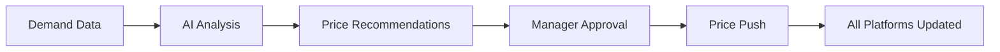
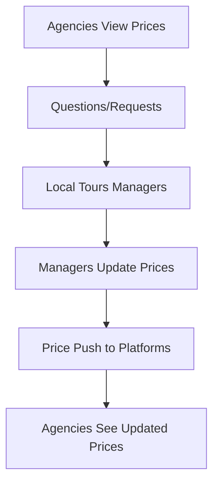

# Price Push Use Cases

Real-world scenarios showing how Price Push solves business problems.

## Use Case 1: Seasonal Pricing Update

### The Challenge

**Company:** Alpine Adventures Tours  
**Situation:** Switching from winter to summer pricing for 45 tour products  
**Timeline:** Must update all platforms by Monday morning  
**Team:** Small team of 3, weekend approaching

**Traditional Approach:**
- Update 45 products × 3 booking platforms = 135 updates
- Estimated time: 6-8 hours
- Risk: Inconsistent prices, human errors
- Problem: No one wants to work weekend

### The Solution with Price Push

**Friday Afternoon (30 minutes):**
```
1. Revenue Manager updates all prices in Walkway
2. Reviews changes (automated validation)
3. Clicks "Push to Ventrata"
4. All platforms updated simultaneously
```

**Result:**
- ✅ Time saved: 7.5 hours
- ✅ Zero errors
- ✅ Consistent pricing across platforms
- ✅ Team goes home on time
- ✅ Ready for Monday rush

**ROI Calculation:**
```
Time saved: 7.5 hours
Hourly rate: €50/hour
Cost savings: €375 per update
Seasonal updates: 4 per year
Annual savings: €1,500
Plus: Eliminated pricing errors (priceless!)
```

---

## Use Case 2: Dynamic Pricing Strategy

### The Challenge

**Company:** City Discovery Tours  
**Situation:** Implementing dynamic pricing based on demand  
**Frequency:** Daily price adjustments  
**Complexity:** 20 tours with 5 price points each

**Traditional Approach:**
- Daily manual updates: 100 price points
- 30 minutes per day
- Risk of missing updates
- Delayed response to market changes

### The Solution with Price Push

**Every Morning (5 minutes):**
```
1. System generates pricing recommendations
2. Revenue Manager reviews
3. Approves changes
4. Price Push syncs to all platforms
```

**Automated Process:**


**Result:**
- ✅ Response time: Same day (was 2-3 days)
- ✅ Revenue increase: 15% in 3 months
- ✅ Time per update: 5 minutes (was 30 minutes)
- ✅ Competitive advantage maintained

---

## Use Case 3: Team Member Promotion

### The Challenge

**Company:** Mediterranean Tours  
**Situation:** Promoting junior team member to pricing manager  
**Need:** Give pricing responsibilities without full admin access  
**Concern:** Security and control

**Before (Without Clear Roles):**
- Either give full access (risky)
- Or make them ask permission every time (slow)
- No middle ground

### The Solution with Price Push Roles

**Simple Process:**
```
1. Change role: Member → Admin
2. Price Push automatically enabled
3. New manager can push prices immediately
4. All actions logged in audit trail
```

**Role Configuration:**
```
Junior Manager (Before)
  Role: Member
  Price Push: ❌ No
  Can view data: ✅ Yes
  Can update prices: ❌ No

Junior Manager (After)
  Role: Admin
  Price Push: ✅ Yes (automatic)
  Can view data: ✅ Yes
  Can update prices: ✅ Yes
```

**Result:**
- ✅ Smooth transition
- ✅ No security gaps
- ✅ Complete audit trail
- ✅ Manager productive from day one
- ✅ Owner retains oversight

---

## Use Case 4: Multi-Platform Launch

### The Challenge

**Company:** Adventure Hub  
**Situation:** Launching on 3 new booking platforms  
**Products:** 60 tours  
**Deadline:** All platforms must go live simultaneously

**Traditional Approach:**
- Manual entry on each platform
- Different formats for each
- High risk of inconsistencies
- 2-3 days of work
- Launch delays common

### The Solution with Price Push

**Launch Day Process:**
```
1. Prepare all pricing in Walkway (one system)
2. Configure API connections for all platforms
3. Single Price Push action
4. All platforms updated simultaneously
5. Verify and go live
```

**Timeline:**
```
Day 1-2: Data preparation (would happen anyway)
Day 3 Morning: Configure API connections (2 hours)
Day 3 Afternoon: Push to all platforms (30 minutes)
Go Live: Same day
```

**Result:**
- ✅ Launch time: 1 day (was 3+ days)
- ✅ Consistency: 100%
- ✅ Errors: Zero
- ✅ Stress level: Minimal
- ✅ Successful simultaneous launch

---

## Use Case 5: Agency Partnership

### The Challenge

**Company:** Local Tours Ltd  
**Situation:** Partnering with 5 travel agencies  
**Need:** Agencies need to view prices but not change them  
**Risk:** Accidental changes or unauthorized discounting

**Solution with Viewer Role:**
```
Partner Agencies
  Role: Viewer
  Price Push: ❌ Disabled
  Can view pricing: ✅ Yes
  Can view availability: ✅ Yes
  Can modify anything: ❌ No
```

**Communication Flow:**


**Result:**
- ✅ Transparency for partners
- ✅ Zero unauthorized changes
- ✅ Fast communication
- ✅ Maintained pricing control
- ✅ Better partner relationships

---

## Use Case 6: Emergency Price Change

### The Challenge

**Company:** Coastal Excursions  
**Situation:** Competitor just dropped prices 20%  
**Need:** Match prices within hours  
**Problem:** Owner is traveling, limited internet

**Traditional Approach:**
- Owner must stop everything
- Log into multiple platforms
- Update manually everywhere
- 2-3 hours minimum
- Likely to miss some platforms

### The Solution with Price Push

**Mobile Response (15 minutes):**
```
1. Owner opens Walkway on mobile phone
2. Updates prices for affected tours
3. Clicks Price Push from mobile
4. All platforms updated
5. Returns to vacation
```

**Result:**
- ✅ Response time: 15 minutes (was 3+ hours)
- ✅ Platform: Mobile device
- ✅ Completeness: All platforms updated
- ✅ Revenue protected: Competitive pricing maintained
- ✅ Owner's vacation: Barely interrupted

---

## Use Case 7: Audit and Compliance

### The Challenge

**Company:** Premium Tours Group  
**Situation:** Financial audit requires proof of pricing changes  
**Need:** Complete trail of who changed what and when  
**Timeline:** Must produce reports within 48 hours

**Traditional Approach:**
- Search through multiple platform logs
- Different formats for each
- Manual compilation
- Incomplete picture
- Days of work

### The Solution with Price Push Audit Trail

**Audit Report Generation:**
```sql
-- Automatic audit trail includes:
- Who made each change
- What was changed (before/after)
- When it was changed
- Which platform(s) were updated
- Whether it was successful
- Who approved the change
```

**Report Format:**
```
Date: 2025-01-15, 10:30 AM
User: john.doe@company.com (Admin)
Action: Price Update
Product: City Tour - Full Day
Before: €50.00
After: €55.00
Status: Successfully pushed to Ventrata
Approved by: Auto (within pricing policy)
```

**Result:**
- ✅ Complete audit trail: Automatic
- ✅ Report generation: Minutes (not days)
- ✅ Compliance: Fully met
- ✅ Auditor satisfaction: High
- ✅ Zero manual work

---

## Use Case 8: Franchise Model

### The Challenge

**Company:** National Tours Network  
**Situation:** Managing 10 franchise locations  
**Need:** Each location controls own pricing  
**Complexity:** Centralized oversight required

**Solution Architecture:**
```
Head Office (Owner)
    ├── Franchise A (Admin - own pricing)
    ├── Franchise B (Admin - own pricing)
    ├── Franchise C (Admin - own pricing)
    └── Central Team (Viewers - monitoring)
```

**Each Franchise:**
- Has own subscription
- Admin controls own prices
- Uses Price Push for their platform
- Reports to head office

**Head Office:**
- Viewer access to all franchises
- Monitors pricing trends
- Ensures brand consistency
- Cannot interfere with local pricing

**Result:**
- ✅ Autonomy: Each franchise manages own prices
- ✅ Efficiency: Fast local decisions
- ✅ Oversight: Head office monitors all
- ✅ Brand protection: Consistency maintained
- ✅ Scalability: Easy to add new franchises

---

## ROI Calculator

### Time Savings

| Scenario | Traditional | With Price Push | Time Saved |
|----------|-------------|-----------------|------------|
| Daily pricing update | 30 min | 5 min | 25 min/day |
| Seasonal update (45 products) | 8 hours | 30 min | 7.5 hours |
| Emergency change | 2 hours | 15 min | 1.75 hours |
| Platform launch | 3 days | 0.5 days | 2.5 days |

### Annual Impact

Assuming:
- 250 business days per year
- Daily updates: 25 min saved
- 4 seasonal updates: 30 hours saved
- 10 emergency changes: 17.5 hours saved

**Total time saved per year: ~151 hours**

At €50/hour = **€7,550 annual savings**  
Plus: Reduced errors, faster response, competitive advantage

---

## Next Steps

- [Learn about API Integration →](api-endpoints.md)
- [Troubleshoot Issues →](troubleshooting.md)
- [Configure Your System →](configuration.md)

---

**Want to discuss your specific use case?** Contact our solutions team at solutions@walkway.com

